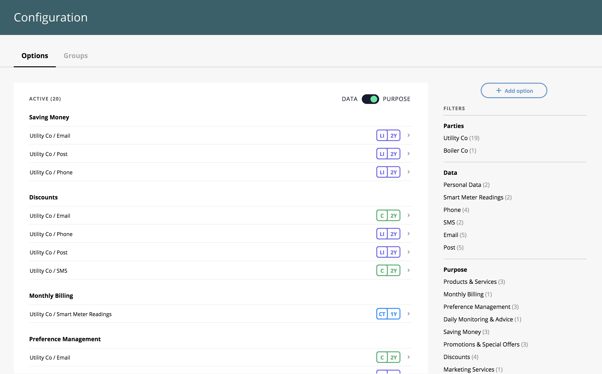
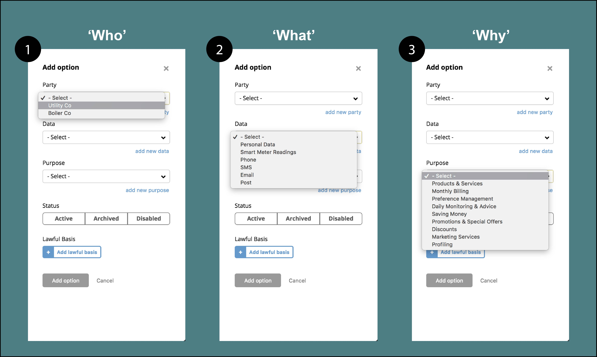
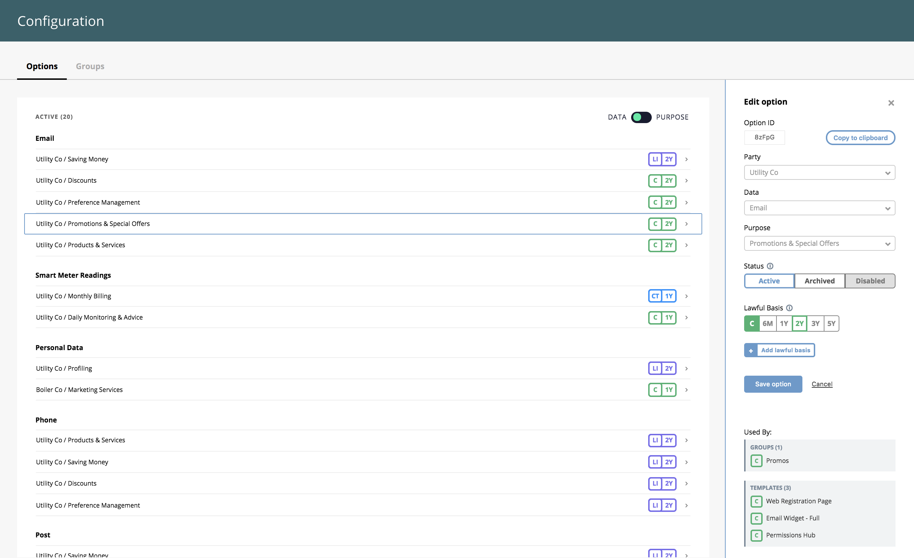

Virtually all industries have been experiencing significant, and sometimes complex change over the last few years. In order to keep up in this rapidly-evolving world, your business must be adaptable. Changes within an organisation often mean new opportunities for leveraging data to offer new or enhanced services and products to customers.  As these new opportunities are realised the required data and processing purposes will need to evolve. Without a highly adaptable Permissions platform this could prove to be a complicated, time consuming and costly process. Here at Consentric we understand the need for businesses to adapt the way they use our system as their business evolves and grows. For this reason, we have designed our platform to support organisations through this change as they build trust with their customers and support GDPR compliance.

### Adapting with Consentric

In the initial set up of Consentric Permissions, your organisation’s Data Protection Officer determines your ‘Configuration’. This forms the cornerstone of your ability to accurately record and relay to a customer what data you hold, what you use it for and who it is shared with.  This Configuration is specific to your organisation.  Within the Configuration the who, what and why are bound together as an ‘Option’ and this is used when a Permissions transaction is recorded. We have created a new section within the platform allowing you to visualise and edit this data in a simple, user-friendly format.  As illustrated in the image the Configuration panel clearly displays the type of data being collected and purposes by which it is processed. We understand that in a large business this may be a highly evolved Config, with many options spanning different departments.  To view specific elements of the Config you are able to use filters in the right hand menu to drill down into exactly the area you are looking for.    **Adding a new option** As your business grows and evolves, new circumstances may arise that require Options to be added (new business processes, mergers, sales, etc).  The creation of a new Option allows you to quickly reflect changes in your business.  This can be created from existing who, what, why elements or these can also be expanded. Once the option is created it becomes immediately available for use over the API or through templates.  It is then just a few clicks to add the new option to a template and make it available on a digital widget to your customers. All this accelerates the consent capture process to enable the faster introduction of new products and services.  (find out more about [Consentric Templates here](https://consentric.io/improve-the-consumer-data-experience-and-build-trust-with-consentric-templates/)).      **Editing an existing option** As well as easily adding new Options, the Configuration allows you to edit or disable any of your current options. In the edit pane you are able to change the lawful basis being used (whether it be consent, legitimate interest, contract etc…) as well as the validity period, a process required under GDPR.  In addition, you are able to change the status of the option to manage and disable an option from being available through the UI or API. With less sophisticated systems making such changes could wreak havoc with existing processes and future data collection practices. For example, disabling an option that is linked to an existing web-form or preference centre could lead to invalid data or technical problems. This is why within the edit pane we show the existing Groups and [Templates](https://consentric.io/improve-the-consumer-data-experience-and-build-trust-with-consentric-templates/) in which the selected Option is included and will not allow you to disable the Option before it is removed. Any other changes made will be updated throughout the entire system.

### 

**How do configuration changes affect my current transactions?** Configuration changes only affect future transactions - all historical transactions remain unchanged.

### Focus your efforts where they’re needed

Those who approach their projects with a rigid system often buckle under the shifting currents of the market. DIY solutions are unlikely to have the necessary capabilities to stay reactive in this ever-evolving world. A SaaS solution such as Consentric leaves you safe in the knowledge that you can adapt your data processes to ensure it remains actionable, letting you focus on building meaningful and profitable relationships with your customers. [Click here](https://consentric.io/consentric-groups-update/) for part 2 of this article looking at "Groups"