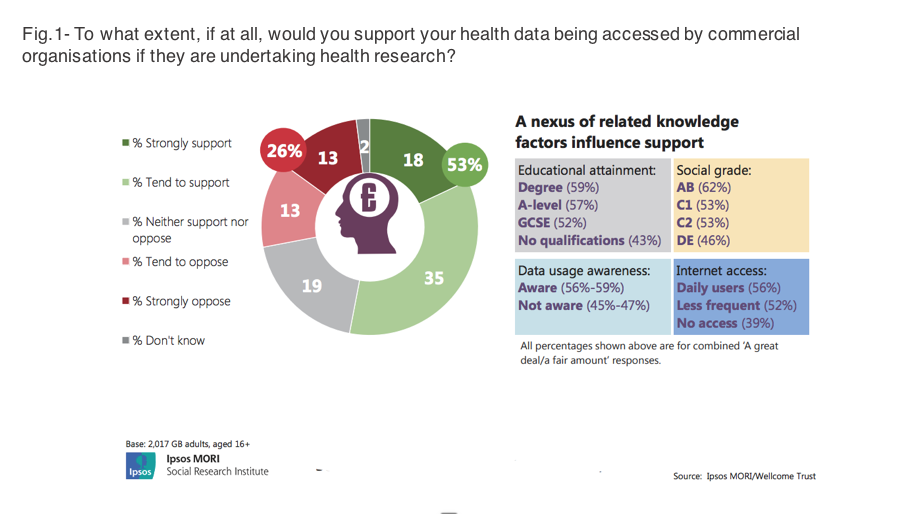

With GDPR effective from May 2018, the NHS will have a legal obligation with patients to be transparent, when portraying what they use their personal data for. They will also have to gain patient permissions for the various data uses. Patient data sharing is vital for the NHS, it allows them to easily access patient records, enabling better primary care decisions to be made. Enhancing patient acceptability is a key factor for improving patient consent. Furthermore, health data shared within the NHS has historically been very attractive to third parties within the healthcare industry, particularly in the medical research and pharmaceutical sector. That said, some patients are uncomfortable with their most sensitive health data being shared outside the boundaries of the NHS. The possibility of sensitive health data, such as information on sexually transmitted diseases, a very private matter, gives the citizen an understandably cautious approach to giving permission to share it. Research from an Ipsos MORI survey, ‘Public Attitudes to the use and sharing of their Data’, showed that only 41 percent of people trust their GP surgery to use their data appropriately, with just 35 percent trusting NHS England to use their data effectively. This is partly down to the lack of transparency between patient and their local NHS trust, causing the patient to have serious concerns over the privacy of their most sensitive data.    Joint research from Ipsos Mori and the Wellcome Trust, as seen above in fig.1, does, however, show a majority of the public support their health data being shared for research purposes. This relates well to what drives acceptability. If the NHS is going to drive forward acceptability, the citizen needs to see a clear public benefit, for example, their data is being used to research and develop specialised Artificial Intelligence that can identify cancerous tumours without human error. Therefore, the citizen needs to have a clear view of why their data is being used and shared. Citizens need to understand who is using their data, with acceptability likely to increase if they see it is public health providers or those with a public interest as well as private. What type of data is being collected will also play a big factor improving citizens perceptions to sharing data. Health data is probably the most sensitive, and private, information held about citizens, therefore citizens want to know it is anonymous, aggregated and that it is being stored on a secure platform. MyLife Digital has the solution, with a mission of rethinking personal data to deliver change, our expertise in data management, protection, and its service capability, reflects the latest thinking and best practice. Using MyLife Digital’s Consentric Permissions, with patient consent at the heart of the system, permissioned data can be collected, collated and shared to provide informed insights for research, policy, treatment and healthcare planning. Individuals will understand the data that’s held, who can see it, where it is shared and for what purpose under GDPR. By putting the citizen first, empowering them to make their own decision on how their data is used, a trust will be built between citizen and organisation. The health industry would benefit from implementing the Consentric Permissions, as it would give the citizen a more informed view of how their personal data is being used, allowing them to make a more informed decision. As patients feel empowered, they will realise the benefits their shared data can bring to the health system in terms of innovation, delivering better patient care across the system and for society. Harry Cromack Policy Analyst – MyLife Digital [Download a copy of this article](https://consentric.io/wp-content/uploads/2018/02/Driving-forward-patient-data-acceptability-in-the-NHS-20180205.pdf)