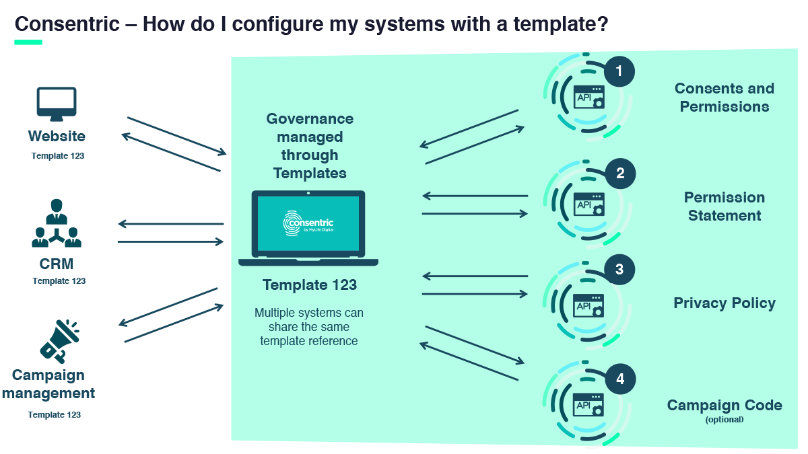

**The key to creating strong consumer engagement strategies is to build great relationships – because all good relationships are built on trust. However, there’s a hitch: today’s consumers are concerned about data privacy and are unwilling to share their data. The good news is that this presents organisations with an opportunity to rethink how they interact with consumers – and to build trust around personal data.** The starting point for organisations must be to present a clear, consistent level of communication at each customer touchpoint – especially when considering the type of personal data that is being requested at each transaction point and the purpose it will be used for.

#### Why is this so important?

According to [Boston Consulting Group](http://image-src.bcg.com/Images/BCG-Leveraging-GDPR-Become-Trusted-Data-Steward-Mar-2018-r_tcm38-186754.pdf), companies that excel at creating trust could increase the amount of consumer data they can access by at least five to ten times. To help create this trust, organisations need to embed consumer-centric strategies. In other words they need to ensure the presentation of consents and permission statements is accurate and can be easily amended based on customer feedback and changing business requirements. Providing transparency on how an individual’s data will be used – and empowering them to control this data usage – will encourage the generation of more personal data. Organisations are then able to develop higher levels of insight to inform more bespoke customer journeys, experiences and innovation, from this rich, trusted data. The outcome would be an increase in value for both organisations and consumers. Ignore this opportunity however, and the eventual result is likely to be reduced consumer trust, strangled flow of customer data and significantly diminished consumer experiences.

#### How do Consentric Templates help create value?

Consentric’s Template feature has the ability to surface the right consents and permissions across an individual’s full consumer journey. From the individual’s perspective they are able to edit their personal data throughout their journey, which helps to ensure a strong and trusted data relationship. Templates also gives an organisation central control to update the consents and permissions displayed to customers across each touchpoint – websites, CRMs and/or customer contact centres. In fact, Consentric templates can be updated and controlled directly across any business system. For example, if a new purpose is added for data processing this can be quickly and immediately updated. The clear value is that any change to the communications or compliance strategy wouldn’t require any IT resource in the form of ongoing updates to consents and permissions – significantly reducing operation costs. Templates themselves contain: 1.    The consents and permissions displayed to the consumer 2.    The privacy statement displayed to the consumer when updating their preferences 3.    A link to your privacy policy 4.    The option to wrap everything up to a campaign code The graphic below indicates the use of templates across multiple systems 

#### What’s the Consentric Templates opportunity?

Consumer experiences and engagement are built on trusted data. Consentric Templates allow organisations to consistently surface the right consents and permissions across the full customer journey. The ease with which templates can be updated allows organisations to refine their presentation of consent and permissions, creating vital additional value. Individuals will receive a more bespoke service, which in turn delivers more loyalty. At the same time, an organisation will gain more data to deliver more bespoke products and services.   Discover more about Consentric templates and the full Consentric platform: [Book a demo](https://consentric.io/book-a-demo/)

### Reinforcing trust by rethinking personal data