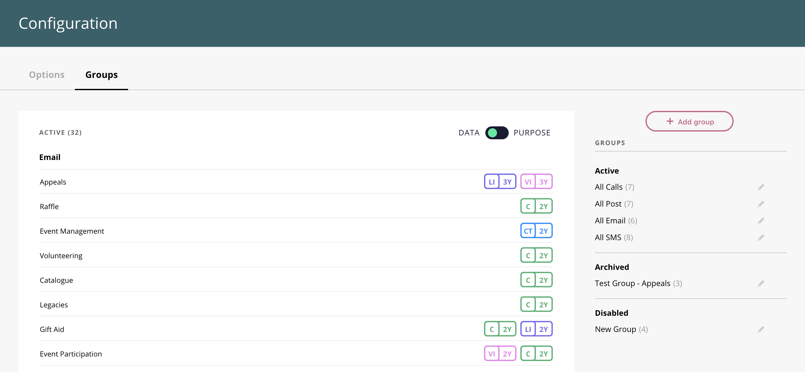
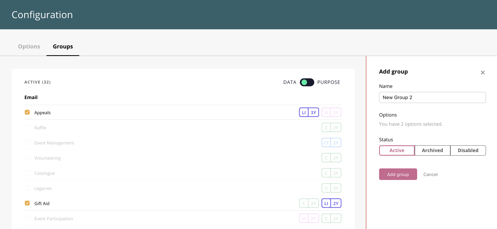

_(this is Part 2 of our previous 'Configuration' feature update). [Find part 1 here](https://consentric.io/configuration-update/)_ As eluded to in the previous product update, your business must be adaptable to keep up in this rapidly-evolving world. The ability to add new options to your [configuration](https://consentric.io/configuration-update/) allows your business to stay reactive in these fast-changing times. A complex organisation will likely amount many options that may need be attended to, by multiple departments, all throughout the year. Keeping everything organized and easily navigable is a process within itself, and can easily detract from other projects’ time and energy.

### Introducing Consentric Groups

Consentric Groups solves this problem, structuring your options in a simple and flexible manner, allowing them to be displayed to or edited by relevant business teams. For example, a marketing department may want to quickly review all options related to outbound email campaigns. These can easily be added to a group on the Configuration page, meaning in just a few clicks the team can view all their existing options in one place. All this saves time, allowing you to create bespoke groups, determined by the wants and needs of each department. This means that teams can seamlessly navigate through the options related to their particular processes. 

### So how do you use Consentric Groups?

**Adding new groups** Adding new groups is simple and intuitive. First, you navigate to the Groups tab at the top of the configuration page. Click on the ‘Add Group’ button on the right side of the page above the Option filters.

1.  Enter a name for the new Group
2.  Select/deselect the Options you wish to be included in the new Group from the right-hand panel. This section will update with the number of Options selected. Note: Options within a Group must share at least one common Lawful Basis for processing.
3.  Set the status of the new Group.

   **Editing Existing Groups** As well as adding new groups you may wish to amend existing groups. Returning to our example of the marketing team; they had previously created a group containing all their Christmas time marketing activities. To add new options to the group they simply need select/deselect the options they require. Due to the seasonal nature of this particular group they are also able to archive the option so that it disappears from the active panel outside of the Christmas period. Groups can also be disabled, removing them from the active panel altogether.  However, this will not permanently delete the group, ensuring to maintain a robust record of past processing activities. All this combines to make a system that evolves with your business, allows multiple teams to simply and comprehensively navigate their preference and data processing options.