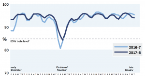

In this research paper we explore the NHS and the obstacles that must be overcome to provide the power and potential for the future, not just for the organisation, but for the patients and society. [Download your copy here](https://consentric.io/wp-content/uploads/2018/02/Data_and_the_future_of_the_NHS-MLD.pdf) or read the plain txt version below

* * *

**Introduction** A data revolution awaits the UK’s under-strain NHS – and it has the potential to transform it into the highly efficient and effective service that we all desire. However, it can only happen if the health sector and its funding agencies recognise and embrace the opportunities ahead. These are locked up in three main issues: creating an IT infrastructure that is fit for purpose; developing new artificial intelligence (AI) solutions across the full range of clinical and non-clinical applications; and most crucially of all, the ability to harness patient data to drive focused and accurate change. It’s the last of these that is arguably the most critical. The new GDPR data regulations coming into force in May will strictly limit what organisations can do with personal and private data including health records, without the individual giving express consent for its use. All the IT and AI in the world can’t help the NHS if patients don’t allow it to use their data. GDPR also provides a chance for the NHS to build a much deeper level of trust and transparency with patients nationwide, optimising the confidence in patient care within the organisation nationwide **NHS in Crisis** It’s February 2018. The NHS is currently going through its annual winter crisis – arguably more pronounced this year than ever before. Bed occupancy rates averaged 94.7%1 in the first weeks of January and peaked at 98-99% in some hospitals (the generally agreed level at which patient safety is assured is 85%). _Bed occupancy rates in December/January 2016/7 and 2017/18_    How did we get here? Let’s examine two key NHS ‘facts of life’. Firstly, the funding of the NHS has been a contentious issue almost since inception in 1948. Historically, NHS funding levels have generally been set around the perceived cost of providing a service for the coming budget period; these are invariably the result of intense negotiation, and the truth is that important considerations such as investing in the future may be pushed to the back of the queue under pressure from the government of the day focusing on improving frontline services with the limited resources available. It’s no surprise to learn that people in the know consider the existing NHS information technology infrastructure to be a fair way short of fit for purpose. In May 2017, the WannaCry cyber-attack crippled 16 UK health trusts and organisations – and in the process highlighted the dated IT systems on which the NHS continues to rely. The National Audit Office’s report into the effect of WannaCry on the NHS2 found that this relatively unsophisticated ransomware attack could have been prevented if the service had followed basic IT security best practice. The second factor at play causing the NHS to creak under stress is simpler: although we’re all living longer on average, we’re not necessarily any healthier. As we get older, we are bringing a wider range of complex conditions and chronic illnesses through the doors of emergency departments across the country. Anecdotal evidence suggests as many as 50% of those seen in A&E are being admitted to hospital, as opposed to a more normal level of 10% _“There are more sophisticated cyber threats out there than WannaCry so the Department and the NHS need to get their act together to ensure the NHS is better protected against future attacks.” Amyas Morse, head of the National Audit Office, 27 October 2017_ **Good News ...** ... there is some funding for AI and robotics The Chief Executive of the NHS, Simon Stevens, has highlighted AI as a specific area of interest, particularly for improving self-care and triage systems in emergency departments3 . Under the Industrial Strategy, there is currently a fund of £1bn to begin research into AI and robotics4 . As it stands, about 30 percent of this fund will be focused on AI in the NHS, with £93 million to be implemented in the first phase and £210 million for research into early diagnostics and precision medicine. However, before we see this as a success, it’s as well to be aware that in comparison with the total NHS budget of around £124.7bn for the financial year 2017/185 these proposed levels of R&D funding are below par for an ambitious developing organisation. What kind of things might this new funding be spent on? Artificial Intelligence (AI) has matured in the past few years from a semi-science fiction dream to hard reality. The precise definition of AI constantly changes depending on the latest developments and the sector in which it is being applied, but whatever the terms of reference, it essentially involves a set of advanced technologies that enable machines to do highly complex tasks effectively – either replacing more labour-intensive approaches to the same functions, or using vast data-processing potential to analyse data and reveal insights that have never before been visible. In medical, clinical and strategic health management, incoming technology includes such breakthroughs as wearables with the ability to track activity levels and monitor heart rates and blood pressure. Users of apps such as Strava and Garmin Express will already be familiar with the principle of automating the way this kind of data can be gathered and presented. And what’s the real benefit to taxpayers of investment in AI for the NHS? A more efficient and effective NHS, treating more patients, more quickly and with higher success rates. Admittedly down the line a bit, but the longer this is neglected, the further away it gets. So let’s look at some specific applications of AI already in use. **AI for the individual** The latest breed of AI systems adds a further dimension to data gathered by wearables, automating the interpretation of this information. In the case of fitness trackers for example, this allows users to build a far more detailed picture of their current health, establish targets and track their progress to them. It’s not hard to recognise the potential benefits in terms of such developments for, say, obesity – mitigating the risk of future health complications and thereby reducing strain on the NHS in key areas of concern in the long term. **AI in public health** What about patients in the care of the NHS? Here, the possibilities are truly exciting Data gathered for individual use from wearables on non-clinical subjects is one thing – but for patients in the care of the NHS the potential is huge. Joint research by The School of Computer Science and the Health Informatics Centre at the University of Manchester used health data to cluster individuals into groups of people with similar characteristics. This enabled them to identify “clusters of patients and new patterns of comorbidity that would not be recognised in any one centre or by one clinician” 8 . In other words, these clusters of patient data uncover new correlations that could be used to develop and deliver preventative interventions and more precise medicine, including new diagnostic and treatment options 9 . This kind of analytical approach has the potential to change the delivery of medical service, not just in the UK but globally, increasing the accuracy of decisions on further treatment for a specific case and reducing the probability of a simple health issue deteriorating into more complex issues. **Bridging the 'Care and Quality' Gap** Artificial intelligence has a significant role to play in the continuing drive to provide a standard high quality of care across the NHS10. AI can capture key segments of research data, targeted at specific medical specialities. By automatically recognising and filtering relevant material from the overall ‘data noise’, clinicians can benefit from enhanced understanding and focus in these key areas. These benefits carry directly through into quality and efficiency of diagnosis, personalised care and, further down the line, medical training for future generations of NHS clinicians. AI is already developing to carry out diagnostics itself. Early diagnosis hugely reduces morbidity, mortality and other complications simply because treatment can begin earlier in a case history, as illustrated in a Reform white paper on AI in the NHS11. _EXAMPLE_ _ In the UK, women between the age of 50 and 70 are advised to have mammograms every three years to screen for breast cancer12. However, evidence from elsewhere suggests that a high proportion of mammograms yield false positive results when interpreted by radiologists. In 2008, breast cancer was over-diagnosed in more than 70,000 women in the US13. AI has been developed that interprets mammograms 30 times faster than humans and with greater accuracy14, demonstrably reducing human error, unnecessary distress and enhancing the patient’s care plan going forward._ **AI in Non-Clinical Applications** There are numerous examples of how AI could transform the performance of NHS hospitals. Here’s just one. _EXAMPLE _ _Improving the flow of patients through a hospital15. A data-driven culture at Wrightington, Wigan and Leigh Hospital has enabled Qlik to develop an app designed specifically to improve patient flow. A dashboard format presentation immediately identifies a patient’s need when they are admitted to hospital. The dashboard shows the capacity in each part of the hospital, enabling an instant decision to be made about the optimum course of care for the patient. During its launch in 2016, WWL was able to reduce its waiting times by half an hour, making it one of the best performing A&E departments in the UK and one of only 10 trusts to meet the government’s four-hour target16._ To state the obvious, the quicker treatment can be given, the better the likely outcome for the patient. On top of that, waiting times are reduced and as a result hospitals can run nearer to peak efficiency. **The Future Looks Bright** There is a hunger to gain further funding for change, an increasing number of amazing AI applications and plenty of desire to improve. Where, then, is the data revolution? As we said at the beginning, the key to this change is that it is data-driven. From May 2018, the NHS will face stringent GDPR controls on what they can do with patient data, and what permissions they require in order to realise the kind of potential we’ve been discussing in this paper. Each patient and individual will need to actively give their consent for how their data is used and shared, both within and outside the NHS. It is vital that the NHS is actively transparent and positive about the beneficial outcomes that will accrue from the consented sharing of patient data. Every individual, whether a patient or not, should be encouraged to take expert advice about consenting to the sharing of their health data. As it stands, this is a huge question mark over the development of potentially beneficial AI technologies for the NHS. A number of thirdparty products including MyLife Digital’s own Consentric platform (see box below) are already available to provide organisations and individuals with the technology to both gather crucial patient data AND allow the individual to be quite specific about what they permit an organisation to do with that data. **Leaping the Permissions Barrier** _CONSENTRIC: A PLATFORM SOLUTION FOR MANAGING PATIENT CONSENT Consented data, real-time data capture and machine learning brought together. One place for all Personal Information Management. That’s secure and convenient. That grows with you. That’s Consentric. The Consentric Platform has consent at its heart. We call it a trust platform, because that’s what we deliver. Consentric opens paths of communication to engage with your patients or customers and strengthen trust. Our mission to rethink personal data and deliver change was born years before the current burst of activity around GDPR. Our expertise in data management, protection, and its service capability, reflects the latest thinking and best practice. Using Consentric, patient consent data can be collected, collated and shared to provide informed insights for research, policy, treatment and healthcare planning. Individuals understand the data that’s held, who can see it, share it and for what purpose. _ [_Learn more here_](https://consentric.io/) **Is the NHS GDPR Ready?** The NHS holds extremely sensitive personal data on health. It needs this data to operate efficiently, and that involves sharing the information across the entire organisation – indeed some data needs to be shared outside the NHS with private organisations engaged in developing new medical solutions. From May 25th, GDPR gives the individual the right to give – or withdraw – consent for specific use and sharing of their personal data. Each individual health trust is responsible for setting its privacy policy in compliance with GDPR, using guidance from NHS England and the Information Government Alliance. However, primary research conducted by MyLife Digital indicates that some NHS trusts are yet to update their privacy policies – a basic step towards compliance with GDPR. Two significant noncompliance issues were identified. When trying to obtain a patient’s medical records, referred to as a Subject Access Request (SAR), we found a lengthy, out-dated system was still in place. To obtain medical records from a hospital trust, a paper form had to be sent to the specific trust. Firstly, it was indicated that a request could take up to 40 days to process, with no clear indication that the request would be granted and supplied with that time period. GDPR clearly states that an organisation must provide subject (patient) requested data within one month. Secondly, the trust sets a cost for providing the information. Under GDPR citizens have a right to obtain information without a financial transaction needed to secure it, rightly empowering the citizen. Each individual trust is responsible for setting its privacy policy and complying with GDPR, with guidance from NHS England and Information Governance Alliance (IGA). The IGA has published a checklist of guidelines for trusts to follow, when preparing for GDPR. While there is clear evidence that NHS England is preparing for the implementation of GDPR, it is important the central body communicates this to trusts across the country. Only by adopting and actively promoting a more transparent privacy policy can the NHS hope to keep patients on-side – nurturing a productive, mutually beneficial and trusting relationship that holds the possibility of delivering a world-class health service for the future. **Building an NHS for the Future** There is clear evidence that government investment in AI and more efficient and effective IT infrastructures can deliver transformational benefits in both the short and long term. The implementation of AI technology across the NHS could yield an almost immediate improvement in levels of care, efficiency and transparency of data sharing throughout the organisation. These opportunities are incredibly exciting. At the same time, as GDPR advances ever closer, the critical need for the NHS to be transparent and forthright in its encouragement of data sharing for the general good can’t be over-emphasised. There is a substantial communication job to be done, firstly to assure NHS users of the value of their personal health data, and then to enable them to take control and allow that data to be used. And alongside this, the NHS needs to persuade the public that it can be trusted with this information. Damage done to the bond of trust between the NHS and its patients by, say, a major data breach, could result in longterm harm to the development of important medical advances. **Sources and Notes** 1 https://www.theguardian.com/society/2018/jan/25/hospitals-still-in-grip-of-winter-crisis-nhs-england-figures-show 2 https://www.nao.org.uk/wp-content/uploads/2017/10/Investigation-WannaCry-cyber-attack-and-the-NHS.pdf 3 Ben Heather, ‘NHS England Will Invest in Artificial Intelligence, Says Stevens’, Health Service Journal, 12 September 2017. 4 HM Government, Industrial Strategy: Building a Britain Fit for the Future, 10. 5 https://www.kingsfund.org.uk/projects/nhs-in-a-nutshell/nhs-budget 6 Michael Grothaus, ‘Popular Data-Driven Weight Loss App Mixes AI And A Human Touch To Boost Success’, Webpage, Fast Company, 3 January 2017. 7 Reform – Thinking on its own: AI in the NHS, 2018. http://www.reform.uk/publication/thinking-on-its-own-ai-in-the-nhs/ 8 National Institute for Health and Care Excellence, Data Science for Health and Care Excellence, 2016. 9 Reform – Thinking on its own: AI in the NHS, 2018. http://www.reform.uk/publication/thinking-on-its-own-ai-in-the-nhs/ 10 NHS England, Five year forward plan. 11 Eleonora Harwich and Kate Laycock, Thinking on its own: AI in the NHS. January 2018 12 http://www.cancerresearchuk.org/about-cancer/breast-cancer/screening/breast-screening 13 Archie Bleyer and Gilbert Welch, ‘Effect of Three Decades of Screening Mammography on Breast-Cancer Incidence’, The New England Journal of Medicine, no. 367 (November 2012); H. Gilbert Welch et al., ‘Breast-Cancer Tumor Size, Overdiagnosis, and Mammography Screening effectiveness’, New England Journal of Medicine, no. 375 (October 2016). 14 Sarah Griffiths, ‘This AI Software Can Tell If You’re at Risk from Cancer before Symptoms Appear’, Wired, 26 August 2016. 15 https://www.qlik.com/us/solutions/industries/healthcare#clinical 16 https://www.buildingbetterhealthcare.co.uk/news/article\_page/Boardtoward\_data\_analytics\_cuts\_AE\_waiting\_times\_at\_Wrightington\_Wigan\_and\_ Leigh\_NHS\_Foundation\_Trust/123610