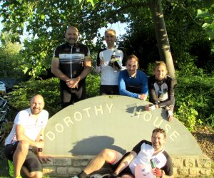

 Congratulations team - they did it! 130 miles in 8 hours 51 minutes of cycling (just over 12 hours door to door, with a stop at each and every [Dorothy House](https://www.dorothyhouse.org.uk/) shop in Wiltshire and Somerset for a selfie, and sometimes a cup of tea!). Remarkably there was only one wheel change, no punctures or falls and they kept a pace of around 15 miles per hour despite the rain, wind, hail and sunshine! Thanks again to Essence Cafe in Midsomer Norton for the Ice-cream and Henley's Cake Company Trowbridge for the cupcakes! Much appreciated. If you would like to donate please [click here](https://www.justgiving.com/fundraising/wft-dorothy-house). Thank you. #130miles4Dotty