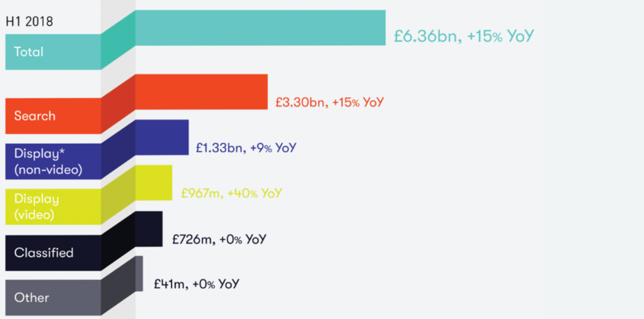

Over recent days there has been several concerning articles in the press, revealing yet more widespread misuse of data across commercial organisations – particularly the digital giants, who still have a lot to learn. Why is this so prevalent? Fundamentally, the business models of many commercial organisations are focussed on mass profits, usually at the expense of consumer privacy. Transparency, is not a core principle in these business models, resulting in the systematic collection of data from people which is then used for many unspecified purposes. Beyond transparency, data privacy and protection have been under the microscope for quite some time – since we entered the Digital or Information Age. Regulators in Europe decided years ago that the Data Protection Act was no longer fit for purpose and redefined the laws to protect the people, their personal data and ultimately privacy, re-iterating this basic human right. Transparency, needs to originate from the organisations that collect, analyse and use our personal data – whether this is for the commercial benefit, health improvements or society betterment. Organisations take information you have provided via online searches, virtual assistants, apps or social media use then process it with machine learning algorithms – created from years of data harvesting and manipulation, this could be for the purposes of forecasting, buyer behaviour modelling, profiling, product and service development or targeted advertising. This, in itself is NOT dishonest business practise, it’s for the common good – _as long as we are aware that they are doing it,_ and that we give our data to them knowingly. (This doesn’t appear to be the case for the 11 apps found wanting by sharing data as the Wall Street Journal discovered recently, as reported by the [BBC](https://www.bbc.co.uk/news/technology-47341533).) If we take targeted advertising, as an example, the majority of us are happy that we are now presented with on-line advertisements that appeal to our latest needs or wants – it saves us time, and this is the value exchange for both parties. [The Drum](https://www.thedrum.com/news/2018/10/10/digital-adspend-increased-15-636bn-the-first-half-2018) re-counted information from IAB UK and PwC, that digital advertisers spent a total of £6.36bn in the first half of 2018, up 15%, according to the Digital Adspend report. It goes on to say that “search makes up half (52%) of this, increasing on par at 15% to £3.3bn, next is non-video display at £1.33bn (+9%), then video display £967m (40%). Classifieds remains at £726m and other remained at £41m.”  These Digital Advertisers wouldn’t increase spending if it wasn’t working. And the vast sums involved must mean the bottom line is seeing results from increased sales. For advertisers to continue this practice, without coming a cropper with the ICO, they need to obtain our permission to use data for the reasons stated – and no other, to agree to protect our privacy and serve us with better innovations, products, services, society and communications. **To protect and to serve our data privacy rights.** One way they can do this is by adopting the right approach and putting their customers first. Give them back control of their data, present them with a way to manage the personal data they hold and the permissions to use or share it. It’s easier than you might think, and there is software available to help.   One such solution is Consentric, our cloud-based GDPR software that provides a comprehensive and compliant record of processing activity for personal and special category data, that can be simply integrated across multiple customer touch-points and into existing CRM’s and systems, including [Salesforce](https://appexchange.salesforce.com/appxListingDetail?listingId=a0N3A00000EcsNmUAJ).