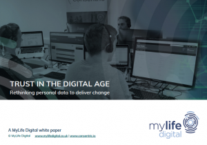

In this increasingly digital world, do individuals understand the amount and worth of the data they generate? Are organisations transparent about how they use and store this personal data? Have the disreputable practices of some organisations damaged consumer trust beyond repair?

In this white paper, we explore 'why rebuilding trust is important', 'the drivers for change', 'GDPR and what it means' - amongst other important issues faced by organisations adapting their data protection practices ahead of the new regulation.

Please download the paper and read it at your leisure, we are not capturing any personal data from you to access it, and ask only that you share it, if you like it!

If you would like a demo of the Consentric Permissions solution simply [book one here](https://consentric.io/book-a-demo/). No face to face hard sale (unless you want it!) just an online webinar or call with one of our lovely Business Development Managers!

[Download Trust in the Digital Age White Paper](https://consentric.io/wp-content/uploads/2017/12/Trust_In_the_Digital_Age_MLD-White_Paper.pdf)

